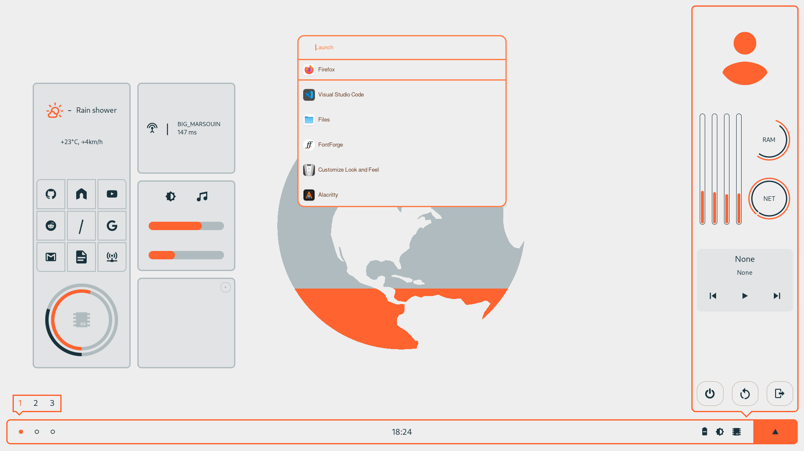
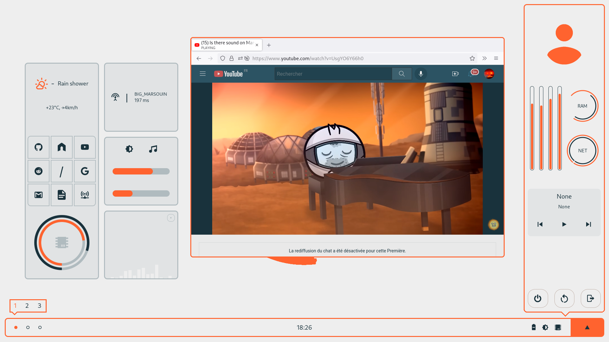
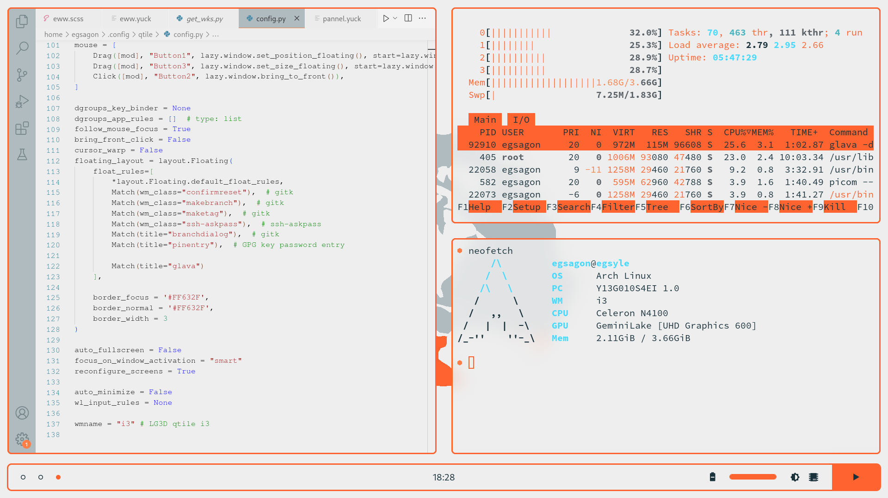

# mars

This is an attempt at making a light themed rice for my laptop.

Color scheme (my own):
  `#EEEEEE`, `#B0BBBF`, `#FF632F`, `#FF7E47`, `#19323C`.

### Specs

- Distro: Arch Linux
- Wm: i3-gaps
- Compositor: picom-tryone-git
- Widgets: eww
- Terminal: Alacritty
- menu launcher: rofi

### Screenshots

